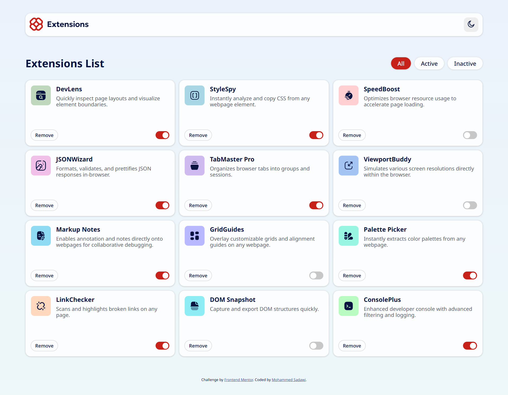
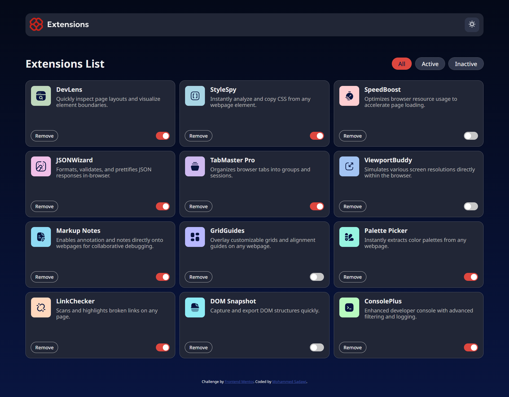
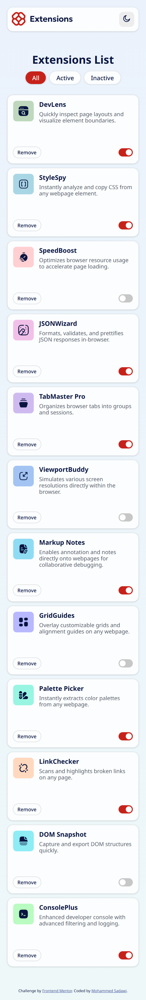
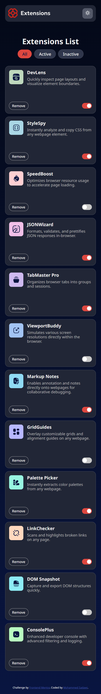

# Frontend Mentor - Browser extensions manager UI solution

This is a solution to the [Browser extensions manager UI challenge on Frontend Mentor](https://www.frontendmentor.io/challenges/browser-extension-manager-ui-yNZnOfsMAp). Frontend Mentor challenges help you improve your coding skills by building realistic projects. 

## Table of contents

- [Installation](#installation)
- [Overview](#overview)
  - [The challenge](#the-challenge)
  - [Screenshot](#screenshot)
  - [Links](#links)
- [My process](#my-process)
  - [Built with](#built-with)
  - [What I learned](#what-i-learned)
  - [Continued development](#continued-development)
  - [Useful resources](#useful-resources)
- [Author](#author)

## Installation

Prerequisites:
- Node.js (v14+ recommended) and npm or Yarn installed.

Quick start (using npm):
1. Clone the repository
   - git clone https://github.com/msadawi1/browser-extension-manager-using-react-css.git
2. Change directory into the challenge
   - cd browser-extension-manager-using-react-css
3. Install dependencies
   - npm install
4. Start the Vite dev server
   - npm run dev
5. Build for production
   - npm run build
6. Preview the production build locally
   - npm run preview

If you prefer Yarn:
- yarn
- yarn dev
- yarn build
- yarn preview

## Overview

### The challenge

Users should be able to:

- Toggle extensions between active and inactive states
- Filter active and inactive extensions
- Remove extensions from the list
- Select their color theme
- View the optimal layout for the interface depending on their device's screen size
- See hover and focus states for all interactive elements on the page

### Screenshot

### Links

- Solution URL: [Frontend Mentor](https://t.co/ZfJcFFIj9Y)
- Live Site URL: [Website](https://t.co/5Ai57xPW8x)

## My process

### Built with

- Semantic HTML5 markup
- CSS custom properties
- Flexbox
- CSS Grid
- [React](https://reactjs.org/) - JS library
- [react-switch](https://www.npmjs.com/package/react-switch) - React component

### What I learned

Learned to handle CSS Grid better than before, and learned about context provider+custom hook design pattern in React

Learned to create CSS variables (my first time in a frontend project)

### Continued development

Would like to learn more about:
- React design patterns
- CSS animations
- And get familiar with UI libraries like Shadcn (since it was painful creating components from scratch)

### Useful resources

- [SVG Editor](https://www.svgviewer.dev/) - helped me in creating a dark mode header logo (since it's not included in the assets)
- [HSL to HEX](https://htmlcolors.com/hsl-to-hex) - helped me convert given HSL colors to HEX since HSL isn't supported by the react-switch component
- [FireShot](https://getfireshot.com/) - used it to take full page screenshots

## Author

- GitHub - [Mohammed Sadawi](https://github.com/msadawi1)
- Frontend Mentor - [@msadawi1](https://www.frontendmentor.io/profile/yourusername)
- Twitter - [@msadaw1](https://x.com/msadaw1)